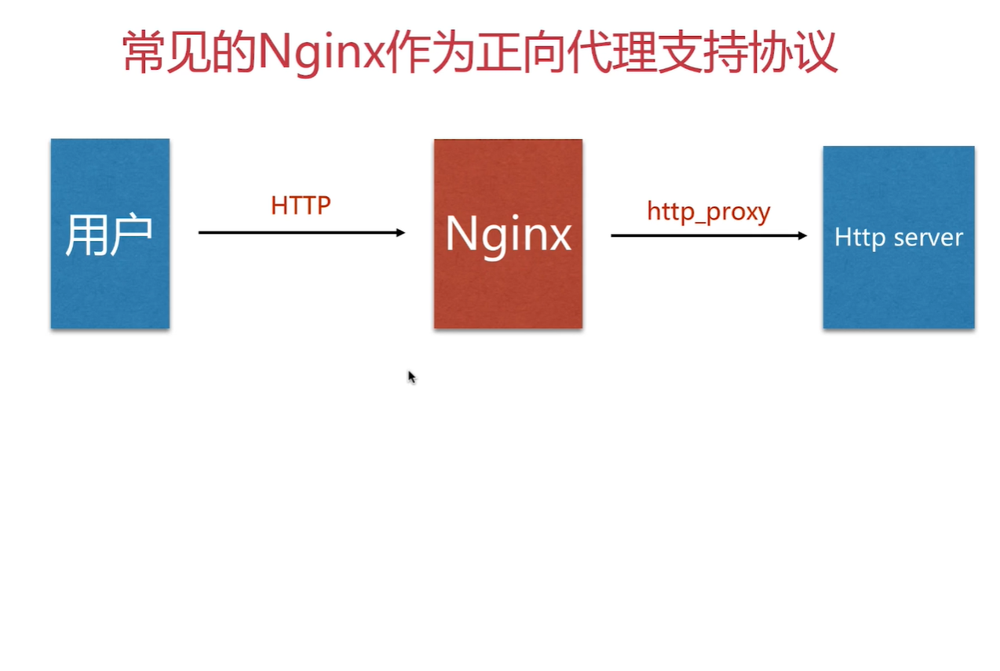

## 正向代理
正向代理代理的对象是客户端，为客户端服务

```
location / {
    if ( $http_x_forward_for !~* "^ip地址") {
        return 403;
    }
    root /opt/app/code;
    index index.html index.htm;
}
```

## 反向代理
反向代理代理的对象是服务端，为服务端服务

|  反向代理模式   | Nginx配置模块  |
|  :----  | :----  |
| http,websocket,https  | ngx_http_proxy_module |
| fastcgi  | ngx_http_fastcgi_module |
| uwsgi  | ngx_http_uwsgi_module |
| grpc  | ngx_http_v2_module |


```
location ~ /test_proxy.html$ {
    proxy_pass http://127.0.0.1:8080;
    proxy_redirect default;
    
    proxy_set_header Host $http_host;
    proxy_set_header X-Real-IP $remote_addr;
    
    proxy_connect_timeout 30;
    proxy_send_timeout 60;
    proxy_read_timeout 60;
    
    proxy_buffer_size 32k;
    proxy_buffering on;
    proxy_buffers 4 128k;
    proxy_busy_buffers_size 256k;
    proxy_max_temp_file_size 256k;
}

```