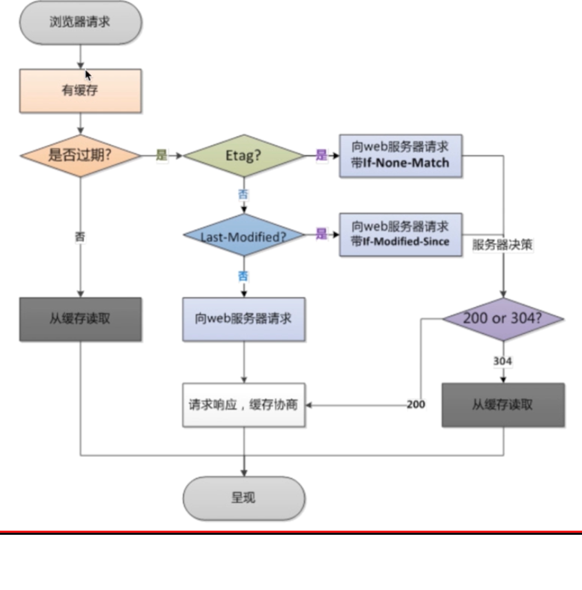

## 文件传输方面

with-file-aio

sendfile

tcp_nopush  作用：sendfile开启的情况下，提高网络包的传输效率

tcp_nodelay 作用：keepalive连接下,提高网络包的传输实时性

gzip 作用：压缩
gzip_comp_level 压缩比
gzip_http_version 压缩版本

```
location ~ .*\.(jpg|gif|png)$ {
    gzip on;
    gzip_http_version 1.1;
    gzip_comp_level 2;
    gzip_types text/plain application/javascript application/x-javascript text/css application/xml text/javascript application/x-httpd-php image/jpeg image/gif images/png;
    root /opt/app/code/images;
}
location ~ .*\.(txt|xml)$ {
    gzip on;
    gzip_http_version 1.1;
    gzip_comp_level 2;
    gzip_types text/plain application/javascript application/x-javascript text/css application/xml text/javascript application/x-httpd-php image/jpeg image/gif images/png;
    root /opt/app/code/images;
}
location ~ ^/download {
    gzip_static on;
    tcp_nopush on;
    root /opt/app/code;
}
```

## 浏览器缓存
1. 校验过期机制

|  校验方式   | 校验key  |
|  :----  | :----  |
| 校验是否过期  | Expires, Cache-Control(max-age) |
| 协议中Etag头信息校验  | Etag |
| Last-Modified头信息校验  | Last-Modified |



```
location ~ .*\.(html|htm)$ {
    expires 24h;
    root /opt/app/code;
}
```

## 跨站访问
```
location ~ .*\.(html|htm)$ {
    add_header Access-Control-Allow-Origin http://***.com;
    add_header Access-Control-Allow-Origin GET,POST,PUT,DELETE,OPTIONS;
    root /opt/app/code;
}

```
## 防盗链
区别那些请求是非正常的用户
1. 基于http_refer防盗链配置模块
```
valid_referers none blocked ***.com;
if ($valid_referers) {
    return 403;
}
```